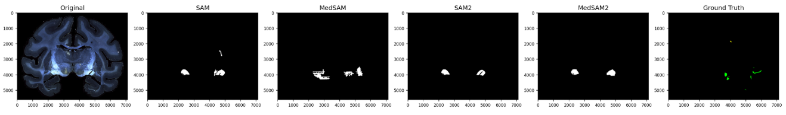

# Benchmarking SAM Models for Fiber Bundle Segmentation

Inference and evaluation code for comparing SAM, MedSAM, SAM2, and MedSAM2 on fiber bundle segmentation in macaque tracer histology.

<p align="center">
  
</p>

## Repository layout

```text
sam_multi_instance.py          Multi-instance SAM-family inference
sam_slice_inference.py         Slice and patch-based SAM-family inference
medsam_zero_shot.py            Frangi-prompted MedSAM inference
evaluate_sam_predictions.py    Evaluate multi-instance predictions
evaluate_medsam_predictions.py Evaluate zero-shot predictions
compare_sam_predictions.py     Compare SAM, MedSAM, and ground truth
segmentation_metrics.py        Shared IoU, Dice, clDice, and object metrics
image_cropping.py              Shared crop helpers
image_utils.py                 Shared mask-resizing helpers
inspect_ome_zarr.py            Inspect an OME-Zarr hierarchy
diagnose_hardware.py           Inspect CPU, RAM, and CUDA capacity
run_sam_multi_instance.slurm   Multi-instance cluster workflow
run_sam_slice.slurm            Slice-inference cluster workflow
tests/                         Automated tests
```

For example, inspect an OME-Zarr store without loading its arrays:

```bash
python inspect_ome_zarr.py /path/to/Outline.ome.zarr
```

## Installation

Create and activate a virtual environment, then install the dependencies:

```bash
python -m pip install -r requirements.txt
```

The scripts additionally require the relevant upstream repository and model
checkpoint. SAM and MedSAM use `segment_anything`; SAM2 and MedSAM2 use their
respective `sam2` repository. Checkpoints are intentionally not stored here.

Verify the command-line interfaces after installing the upstream model code:

```bash
python sam_slice_inference.py --help
python sam_multi_instance.py --help
python medsam_zero_shot.py --help
```

## Expected data layout

`--base-dir` must point to a directory containing subjects in this form:

```text
<base-dir>/
└── sub-MF191/
    └── micr/
        ├── sub-MF191_<acquisition>_stain-LY_DF.ome.zarr/
        └── masks/
            ├── Outline.ome.zarr/
            ├── Fiber_dense_bundle.ome.zarr/
            ├── Fiber_moderate_bundle.ome.zarr/
            └── Fiber_light_bundle.ome.zarr/
```

Inference requires the histology and outline stores. The three fiber-bundle
masks are ground truth and are only required for evaluation.

Use the inspector to confirm available pyramid levels and array shapes:

```bash
python inspect_ome_zarr.py \
  /path/to/data/sub-MF191/micr/masks/Outline.ome.zarr
```

## Quick start

`sam_slice_inference.py` is the recommended entry point for comparing all four
models. Start with one slice to validate paths, dependencies, and GPU memory:

```bash
python sam_slice_inference.py \
  --model sam \
  --checkpoint /path/to/sam_vit_b_01ec64.pth \
  --base-dir /path/to/data \
  --subject MF191 \
  --level 4 \
  --start-slice 12 \
  --end-slice 13 \
  --output-dir predictions/sam
```

For SAM2 or MedSAM2, also provide the model configuration:

```bash
python sam_slice_inference.py \
  --model sam2 \
  --checkpoint /path/to/sam2_hiera_large.pt \
  --sam2-config /path/to/sam2_config.yaml \
  --base-dir /path/to/data \
  --subject MF191 \
  --start-slice 12 \
  --end-slice 13 \
  --output-dir predictions/sam2
```

Evaluate multi-instance output with:

```bash
python evaluate_sam_predictions.py \
  --predicted-dir predictions/sam \
  --base-dir /path/to/data \
  --subject MF191 \
  --level 4
```

Slice ranges follow Python convention: the start is inclusive and the end is
exclusive. Once a one-slice run succeeds, remove the range arguments or expand
them to process the full subject.

## Supported models

| Value | Implementation | Typical checkpoint |
|---|---|---|
| `sam` | Segment Anything | `sam_vit_b_01ec64.pth` |
| `medsam` | MedSAM | `medsam_vit_b.pth` |
| `sam2` | SAM2 | `sam2_hiera_large.pt` |
| `medsam2` | MedSAM2 | `MedSAM2_latest.pt` |

## Choosing a pipeline

| Goal | Command |
|---|---|
| Compare SAM, MedSAM, SAM2, and MedSAM2 consistently | `sam_slice_inference.py` |
| Detect and segment several bundles independently in each slice | `sam_multi_instance.py` |
| Run the Frangi-prompted MedSAM experiment | `medsam_zero_shot.py` |

Start with `sam_slice_inference.py`. The other pipelines are specialized
experiments and are not required for the basic comparison workflow.

## Experimental prompts

[SAM](https://arxiv.org/abs/2304.02643) segments from spatial prompts such as
foreground/background points or a bounding box. For these experiments, the
prompts were generated from the image instead of placed manually.

The slice pipeline uses high-intensity regions inside the brain outline as
positive points. The multi-instance pipeline first estimates candidate regions,
then gives SAM one box and a set of positive and negative points for each
candidate. The MedSAM zero-shot experiment uses a different heuristic: Frangi
filtering highlights ridge-like structures, positive points are sampled along
the skeleton of that response, and negative points are sampled just outside it.

Frangi was tried because labeled fiber bundles often appear as thin, elongated
structures. It provided a simple way to place prompts along a possible bundle
without training a prompt generator. This was an exploratory choice. Its response is sensitive to
contrast, scale, staining variation, and other bright linear structures, so the
result should be treated as an experimental baseline.

## Future work

The next step is to replace or complement these hand-designed prompts with
adaptation learned from labeled fiber-bundle masks. Useful comparisons would
include full fine-tuning, decoder-only fine-tuning, learned prompt generation,
and parameter-efficient methods such as LoRA or adapters.

LoRA is worth testing when the labeled dataset or GPU budget is limited.
[SAMed](https://arxiv.org/abs/2304.13785) applied LoRA to the SAM image encoder
while training the prompt encoder and mask decoder on labeled medical images.
[Medical SAM Adapter](https://arxiv.org/abs/2304.12620) provides a related
adapter-based approach, and the
[MedSAM study](https://doi.org/10.1038/s41467-024-44824-z) notes that additional
fine-tuning can help with less represented modalities and intricate structures.
These results motivate the experiment, but they do not establish which strategy
will work best for macaque tracer data.

A future study should compare the zero-shot baselines in this repository against
the same SAM backbones adapted on train/validation splits from the fiber-bundle
dataset. Evaluation should report Dice, IoU, clDice, object-level sensitivity,
false discoveries, performance by bundle density, and generalization to held-out
subjects. LoRA should be considered successful only if it improves those held-out
results without introducing unacceptable false-positive detections.

## SAM slice inference

One parameterized SLURM workflow replaces the previous model-specific copies:

```bash
sbatch --export=ALL,SAM_MODEL=sam,SAM_CHECKPOINT=/path/to/sam.pth,BASE_DIR=/path/to/data run_sam_slice.slurm
sbatch --export=ALL,SAM_MODEL=medsam,SAM_CHECKPOINT=/path/to/medsam.pth,BASE_DIR=/path/to/data,START_SLICE=12,END_SLICE=30 run_sam_slice.slurm
sbatch --export=ALL,SAM_MODEL=sam2,SAM_CHECKPOINT=/path/to/sam2.pt,SAM2_CONFIG=/path/to/config.yaml,BASE_DIR=/path/to/data run_sam_slice.slurm
```

Valid values for `SAM_MODEL` are `sam`, `medsam`, `sam2`, and `medsam2`.
The workflow also accepts `BASE_DIR`, `SUBJECT`, `PYRAMID_LEVEL`,
`OUTLINE_LEVEL`, `OUTPUT_DIR`, `START_SLICE`, and `END_SLICE`. Slice ranges use
Python convention: the start is inclusive and the end is exclusive.
Set `VENV_ACTIVATE` to the environment activation script, `REPO_DIR` when jobs
are submitted outside the repository, and `SAM_REPOS` to any upstream SAM2 or
MedSAM2 repositories that must be added to `PYTHONPATH`.

## MedSAM zero-shot

Generate bundle predictions using Frangi-based point prompts:

Example:
```bash
python medsam_zero_shot.py \
  --checkpoint /path/to/medsam_vit_b.pth \
  --subjects MR243 \
  --base-dir /path/to/data \
  --predicted-root fiber-bundle-segmentation-benchmarking/predictions/MedSAM_zero_shot
```

Notes:

- Output PNGs are saved as `bundle_{slide}_0000_pred.png` and can be evaluated with `python evaluate_medsam_predictions.py`.
- If you already load from a downsampled level (e.g. level 4), consider `--downsample-factor 1` to avoid double downsampling.

Evaluate the zero-shot output:

```bash
python evaluate_medsam_predictions.py \
  --predicted-root predictions/MedSAM_zero_shot \
  --base-dir /path/to/data \
  --subjects MR243 \
  --level 4
```

Every executable provides its accepted options through `--help`; configuration
does not require editing source files.

```bash
python -m compileall -q .
python -m unittest discover -s tests -v
ruff check .
ruff format --check .
```
